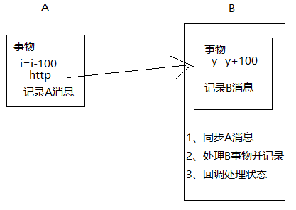

## 基于HTTP的分布式事物框架

#### 基本原理



#### 依赖：

jkd1.8，springboot，mybatis-plus，fastjson，mysql


#### 使用：

##### Consumer系统：

* 数据库表：

```mys
CREATE TABLE `master_task` (
`id` varchar(64) NOT NULL,
`url` varchar(255) DEFAULT NULL COMMENT 'url',
`req_str` varchar(2048) DEFAULT NULL COMMENT '请求参数',
`status` int(11) DEFAULT NULL COMMENT '任务状态 0待处理，1已处理',
`add_time` datetime DEFAULT NULL,
`process_time` datetime DEFAULT NULL,
`module_name` varchar(255) DEFAULT NULL COMMENT '模块服务名称',
PRIMARY KEY (`id`)
) ENGINE=InnoDB DEFAULT CHARSET=utf8mb4;
```

* 依赖：

```xml
<dependency>    
  <groupId>com.distributedtx</groupId>    
  <artifactId>dtx-spring-boot-starter</artifactId>    
  <version>1.0</version>
</dependency>
```
* Service层代码：

``` java
@Autowired
private DtxHttpUtil dtxHttpUtil;
@Transactional
public String update(Integer num) {
    hfkT1Mapper.updateById(new HfkT1(1,num,""+num));
    dtxHttpUtil.sendDtxPost("http://localhost:8089/leavebill/update",
"{\"id\":\"1\",\"type\":"+num+",\"content\":\""+num+"\"}","provider");
//  int a = 10/0;
    return "ok";
}
```

> 注意：使用框架提供的依赖工具：**com.distributedtx.utils.DtxHttpUtil**.sendDtxPost(url, requestBody,B系统的name);

##### Provider系统

* 数据库表：

```mys
CREATE TABLE `provider_task` (
`id` varchar(64) NOT NULL,
`url` varchar(255) DEFAULT NULL COMMENT 'url',
`req_str` varchar(2048) DEFAULT NULL COMMENT '请求参数',
`status` int(11) DEFAULT NULL COMMENT '任务状态 0待处理，1已处理，2已回调',
`add_time` datetime DEFAULT NULL,
`process_time` datetime DEFAULT NULL,
`try_times` int(11) DEFAULT NULL COMMENT '处理次数',
PRIMARY KEY (`id`)
) ENGINE=InnoDB DEFAULT CHARSET=utf8mb4;
```

  

* 依赖：

```xml
<dependency>    
    <groupId>com.distributedtx</groupId>    
    <artifactId>dtx-spring-boot-starter</artifactId>    
    <version>1.0</version>
</dependency>
```

* 配置类：application.yml

``` properties
spring:
  application:
    name: provider  # 必填，A系统调用时，需要指定发给哪个被调系统
dtx:
  tryTimes: 3  #可选，默认3
  consumerUrl: http://localhost:8088  #可选，A系统的调用地址（如果A系统有配置server.name则地址为:8088/servername），如果A,B数据库是同一台，此设置可省去，否则得加
```

* 启动类：

```java
@EnableDtxProvider  //开启被掉系统的事物处理功能
@SpringBootApplication
public class App {
    public static void main(String[] args) {
        SpringApplication.run(App.class, args);
    }

}
```

> 注意这里需要开启分布式事物功能 **@EnableDtxProvider**

* Controller层代码：

```java
@PostMapping("/update")
public String update(@RequestBody BankCard card){
    bankCardService.updateById(card);
    return "更新成功";
}
```

> 注意：这里的requestBody 对象必须包含一个方法 **getMsgId**，这个方法用于传递A到B的消息
>
> 如果controller不需要requestBody，则使用**com.distributedtx.domain.CommonParam**作为参数
>
> 例子中的BankCard 继承 **com.distributedtx.domain.CommonParam**也可以

* Service层代码

```java
@DtxTransactional
public int updateById(BankCard card){
    return bankCardMapper.updateById(card);
}
```

> 这里使用 **@DtxTransactional** 注解


> 启动顺序，推荐先启动Consumer，然后是Provider


